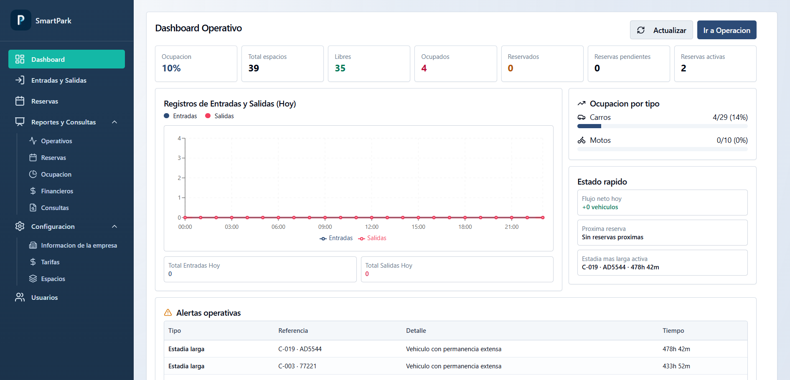
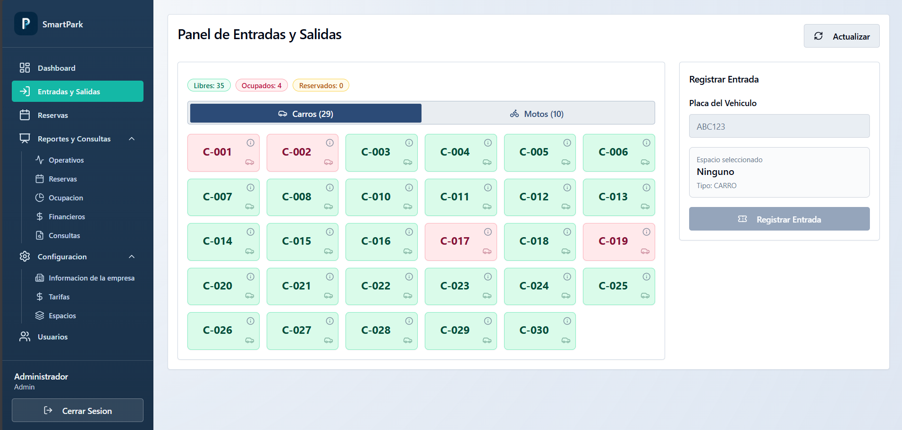
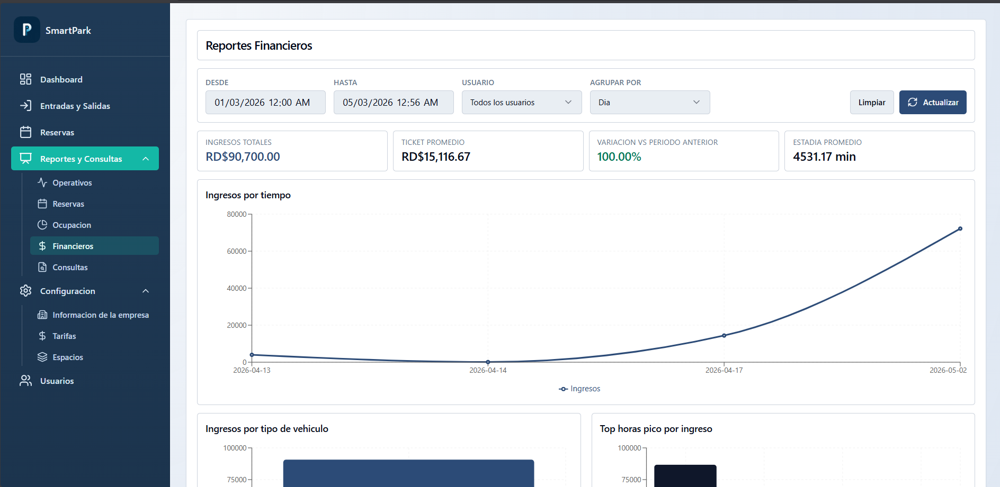
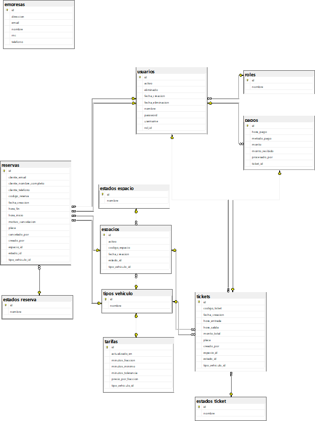

# SmartPark - Sistema de Administración de Parqueo

    

## 📋 Descripción del proyecto

**SmartPark** es un sistema de administración de parqueo diseñado para digitalizar y automatizar las operaciones de un estacionamiento. La idea central es reemplazar el control manual —registros en papel, cálculos manuales de cobro, seguimiento informal de espacios— por una solución de software que garantice precisión, trazabilidad y eficiencia en cada operación.

El sistema cubre el ciclo operativo completo de un parqueo: desde que un vehículo entra hasta que sale y paga. Permite registrar la entrada de vehículos asignándoles un espacio numerado, monitorear en tiempo real cuáles espacios están libres u ocupados, calcular automáticamente el monto a cobrar según el tipo de vehículo (carro o moto) y las tarifas configuradas, registrar el método de pago (efectivo o tarjeta), y consultar el historial completo de operaciones.

---

## 🛠️ Tecnologías usadas

El proyecto está construido bajo una arquitectura cliente-servidor robusta y moderna:

### Back-end
* **Java 21:** Lenguaje de programación principal.
* **Spring Boot 3:** Framework para el desarrollo ágil de la API REST.
* **Spring Security & JWT:** Para el control de acceso, autenticación y autorización.
* **Spring Data JPA / Hibernate:** ORM para la persistencia de datos.
* **PostgreSQL:** Motor de base de datos relacional.
* **OpenPDF:** Generación de reportes y tickets en formato PDF.
* **Maven:** Gestor de dependencias y construcción del proyecto.

### Front-end
* **React 19:** Biblioteca principal para la construcción de interfaces de usuario.
* **Vite:** Herramienta de construcción y entorno de desarrollo ultra rápido.
* **Tailwind CSS:** Framework de utilidades para el diseño y estilizado.
* **Recharts:** Biblioteca para la generación de gráficos interactivos.
* **Axios:** Cliente HTTP para la comunicación con el API.

### Observabilidad e Infraestructura
* **Prometheus:** Recolección y almacenamiento de métricas (vía Micrometer Actuator).
* **Grafana:** Visualización de dashboards operativos.
* **Docker & Docker Compose:** Orquestación de contenedores para el stack de monitoreo.

---

## ✨ Funcionalidades

* **Control de Accesos (Entradas y Salidas):** Registro fluido de la entrada y salida de vehículos usando su número de placa, con asignación inteligente de espacios.
* **Monitoreo en Tiempo Real:** Tablero (Dashboard) que muestra el estado actual de todos los parqueos (Libre, Ocupado, Reservado, Mantenimiento).
* **Facturación Automatizada:** Motor de cálculo de tarifas dinámico basado en tiempo de estadía, tolerancia, fracciones y tipo de vehículo (Carro/Moto).
* **Gestión de Reservas:** Creación, cancelación y asignación de espacios para reservaciones anticipadas.
* **Módulo de Reportes:** Generación de reportes operativos, financieros, de ocupación y de reservas, exportables a PDF.
* **Gestión de Usuarios:** Sistema de roles (Administrador y Operador) para restringir acciones sensibles y visualización de reportes financieros.
* **Parametrización:** Configuración de la información de la empresa, tarifas y estado de los espacios de parqueo.

---

## 📸 Capturas

Capturas de referencia (puedes reemplazarlas por imágenes reales del sistema):





---

## 📁 Estructura del proyecto

El proyecto está organizado de manera modular en las siguientes capas:

```text
parking-system/
├── back-end/                  # Aplicación de servidor (API REST)
│   ├── src/main/java/...      # Lógica de negocio: Controladores, Servicios, Entidades, Repositorios
│   ├── src/main/resources/    # Configuración del servidor (application.properties)
│   └── pom.xml                # Configuración de dependencias de Maven
├── front-end/                 # Aplicación web SPA (Cliente)
│   ├── src/api/               # Servicios de integración HTTP con Axios
│   ├── src/components/        # Componentes UI reutilizables (Diseño Atómico)
│   ├── src/pages/             # Vistas principales y módulos de la aplicación
│   └── package.json           # Dependencias y scripts de Node
├── observability/             # Herramientas de monitoreo y métricas del sistema
│   ├── docker-compose.yml     # Orquestador para contenedores de monitoreo
│   ├── grafana/               # Configuración y Dashboards visuales
│   └── prometheus.yml         # Reglas de scrapping de métricas
├── db-diagram.png             # Diagrama Entidad-Relación físico de la base de datos
└── seed_datos_iniciales.sql   # Script SQL con la data semilla del sistema
```

---

## 🚀 Pasos para ejecutar localmente

### Requisitos previos
* **Java 21** o superior.
* **Maven**
* **Node.js** (v18+) y un gestor de paquetes (`npm`, `yarn` o `pnpm`).
* **PostgreSQL** (Servidor corriendo localmente).
* **Docker** (Opcional, solo si deseas visualizar métricas de observabilidad).

### 1. Preparar la Base de Datos
1. Crea una base de datos en PostgreSQL (por defecto sugerimos `parking-system` o revisa tu `application.properties`).
2. Conéctate a tu base de datos recién creada y ejecuta el archivo `seed_datos_iniciales.sql` que se encuentra en la raíz del proyecto. Este script preparará los roles, estados y creará los usuarios por defecto:
   - **Administrador**: `admin` / `admin123`
   - **Operador**: `operador` / `operador123`

### 2. Configurar e Iniciar el Back-end
Abre una terminal y dirígete a la carpeta `back-end`:
```bash
cd back-end
```
Verifica que las credenciales de la base de datos (usuario, contraseña y URL) coincidan con las de tu entorno local en el archivo `src/main/resources/application.properties`. Luego ejecuta:
```bash
# En Windows
mvnw.cmd spring-boot:run

# En Linux/macOS
./mvnw spring-boot:run
```
La API REST estará corriendo en `http://localhost:8080`.

### Variables de Entorno (Back-end)
El proyecto está configurado para ejecutarse localmente sin necesidad de configuraciones adicionales gracias a los valores por defecto. Sin embargo, para entornos de producción o configuraciones personalizadas, puedes utilizar las siguientes variables de entorno:

| Variable | Descripción | Valor por Defecto |
|---|---|---|
| `APP_TIMEZONE` | Zona horaria de la aplicación | `America/Santo_Domingo` |
| `APP_CORS_ALLOWED_ORIGIN` | Origen permitido para peticiones CORS | `http://localhost:3000` |
| `SPRING_DATASOURCE_URL` | URL de conexión a la base de datos | `jdbc:postgresql://localhost:5432/parking-system` |
| `SPRING_DATASOURCE_USERNAME` | Usuario de la base de datos | `postgres` |
| `SPRING_DATASOURCE_PASSWORD` | Contraseña de la base de datos | `postgres` |
| `JWT_SECRET` | Clave secreta para firmar los tokens JWT | `ParkingSystem2026SecretKey...` |
| `JWT_EXPIRATION` | Tiempo de expiración del token en ms | `86400000` (24 horas) |
| `MAIL_HOST` | Servidor SMTP para envío de correos | `smtp.gmail.com` |
| `MAIL_PORT` | Puerto del servidor SMTP | `587` |
| `MAIL_USERNAME` | Usuario para autenticación SMTP | *(vacío)* |
| `MAIL_PASSWORD` | Contraseña para autenticación SMTP | *(vacío)* |

### 3. Configurar e Iniciar el Front-end
Abre una nueva pestaña en tu terminal y dirígete a la carpeta `front-end`:
```bash
cd front-end
```
Instala las dependencias y corre el servidor de desarrollo:
```bash
npm install   # o pnpm install
npm run dev   # o pnpm dev
```
La aplicación web estará disponible en `http://localhost:3000`.

### 4. Iniciar Observabilidad (Opcional)
Para tener gráficas de rendimiento sobre la aplicación en Grafana:
```bash
cd observability
docker-compose up -d
```
Podrás acceder a Prometheus en `http://localhost:9090` y a Grafana en `http://localhost:3001`.

---

## 🗄️ Diagrama de la base de datos

A continuación se presenta el diagrama Entidad-Relación (E-R) que sustenta la estructura de datos para la gestión de vehículos, tarifas, usuarios y parqueos.


